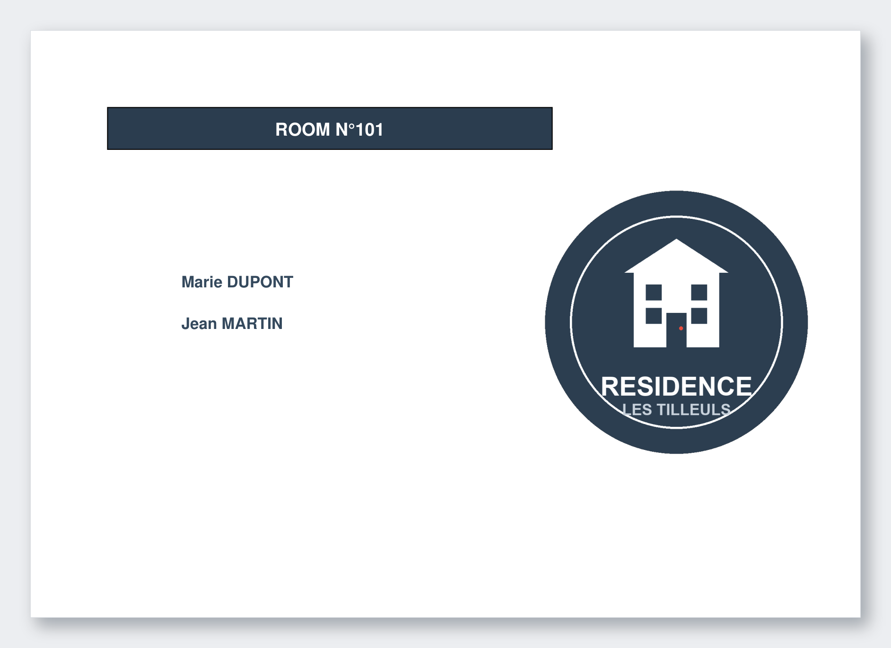

<div align="center">

# CSV → PDF Room Card Generator
### Génération automatique de fiches de chambre imprimables depuis un fichier CSV

[](https://www.python.org/)
[](LICENSE)
[](https://www.reportlab.com/)
[](https://github.com/)

**[Français — vous êtes ici]** · **[English → README.md](README.md)**

</div>

---

Script Python qui génère un **PDF paysage A4** depuis un CSV : une page par chambre, numéro en bandeau coloré, noms des occupants en grande police et votre logo. Prêt à imprimer et afficher sur les portes.

**Cas d'usage :** colonies de vacances · séjours scolaires · internats · auberges de jeunesse · résidences étudiantes · camps sportifs · hôtels · centres de loisirs · hébergements de groupe · voyages organisés

---

## Aperçu



---

## Fonctionnalités

| Fonctionnalité | Détail |
|----------------|--------|
| Détection de l'encodage | `chardet` identifie automatiquement UTF-8, Windows-1252, Latin-1, UTF-16… — aucune conversion manuelle |
| Détection du délimiteur | Détecte `,`, `;`, tabulation et `\|` automatiquement, avec repli sur le comptage de fréquence — formats américain et européen pris en charge |
| Mise en page dynamique | Bloc occupants ajusté selon le nombre de personnes (de 1 à 8+) |
| Logo personnalisable | PNG redimensionné à 4×4 pouces, aligné à droite (fond transparent ou non) |
| Pagination automatique | Un saut de page par chambre — autant de chambres que le CSV en contient |

---

## Format du fichier CSV

Chaque ligne = une chambre :

```
numéro_chambre, prénom_1, nom_1, prénom_2, nom_2, ...
```

| Colonne | Contenu |
|--------|---------|
| `[0]` | Numéro ou nom de la chambre |
| `[1]` / `[2]` | Prénom / Nom du 1er occupant |
| `[3]` / `[4]` | Prénom / Nom du 2ème occupant *(optionnel)* |
| `…` | Paires supplémentaires *(optionnelles)* |

```csv
101,Marie,Dupont,Jean,Martin
102,Lucie,Bernard
214,Alice,Moreau,Emma,Leroy,Sofia,Petit
305,Paul,Durand,Thomas,Girard
```

> Lignes vides ignorées · nombre d'occupants variable (minimum 1) · colonne orpheline silencieusement ignorée · noms en MAJUSCULES, prénoms en casse normale

---

## Préparer le CSV

### Depuis Microsoft Excel (xlsx → csv)

1. Ouvrez le fichier `.xlsx` et structurez vos données *(une ligne = une chambre)*
2. **Fichier → Enregistrer sous** → type : **CSV UTF-8 (délimité par des virgules) (\*.csv)**
   - Si l'option UTF-8 est absente, "CSV séparé par des points-virgules" fonctionne également — le script détecte le délimiteur automatiquement.
3. Confirmer les avertissements.

### Depuis Google Sheets

**Fichier → Télécharger → Valeurs séparées par des virgules (.csv)**  
Le fichier est exporté en UTF-8 avec virgules — format idéal.

### Depuis LibreOffice Calc

**Fichier → Enregistrer une copie** → **Texte CSV (.csv)**  
Dans la boîte de dialogue : jeu de caractères **UTF-8** · séparateur `,` ou `;`

---

## Installation & Utilisation

**Prérequis : Python 3.7+**

```bash
pip install reportlab chardet
```

```
mon-projet/
├── script.py
├── chambres.csv
├── logo.png
└── output.pdf          ← généré automatiquement
```

```bash
# Usage de base — génère output.pdf dans le dossier courant
python script.py chambres.csv logo.png

# Spécifier le fichier de sortie
python script.py chambres.csv logo.png -o fiches_chambres.pdf

# Fichiers dans des sous-dossiers
python script.py data/listes.csv assets/logo_ecole.png -o exports/fiches_2024.pdf

# Chemins absolus
python script.py /home/user/documents/chambres.csv /home/user/images/logo.png -o /home/user/bureau/resultat.pdf

# Chemin avec espaces (guillemets obligatoires)
python script.py "mon dossier/liste chambres.csv" logo.png
```

| Argument | Obligatoire | Description |
|---------|------------|-------------|
| `fichier_csv` | Oui | Chemin vers le fichier CSV |
| `fichier_logo` | Oui | Chemin vers le logo PNG |
| `-o` / `--output` | Non | Fichier de sortie (défaut : `output.pdf`) |

---

## Dépendances

| Bibliothèque | Version | Rôle |
|-------------|---------|------|
| `reportlab` | ≥ 3.6 | Génération PDF (mise en page, texte, images) |
| `chardet` | ≥ 4.0 | Détection automatique de l'encodage CSV |
| `csv`, `argparse` | stdlib | Inclus dans Python |

---

## Dépannage

| Problème | Solution |
|---------|---------|
| Accents mal affichés | Réenregistrer le CSV en UTF-8 (voir section *Préparer le CSV*) |
| Logo absent | Vérifier que c'est un PNG et que le chemin est correct |
| `The CSV file does not exist` | Entourer le chemin de guillemets s'il contient des espaces |
| Occupants manquants | Chaque occupant requiert **deux colonnes** (prénom + nom) |

---

## Personnalisation

```python
PAGE_MARGIN  = 72                            # Marges (points typographiques)
HEADER_COLOR = colors.HexColor("#2c3e50")   # Couleur du bandeau
TEXT_COLOR   = colors.HexColor("#34495e")   # Couleur des noms
```

Couleurs alternatives : `#c0392b` rouge · `#27ae60` vert · `#8e44ad` violet · `#d35400` orange · `#1a252f` bleu marine

---

## Contribuer

Issues et pull requests bienvenues : support JPEG/SVG · polices personnalisées · mode portrait · templates multiples.

---

<div align="center">

**[English → README.md](README.md)**  
*Réalisé avec ReportLab*

</div>
